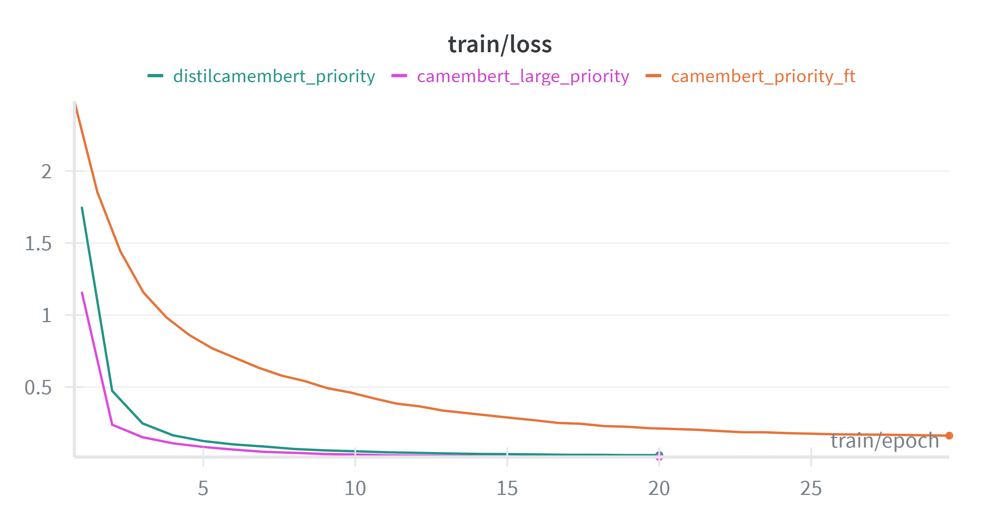
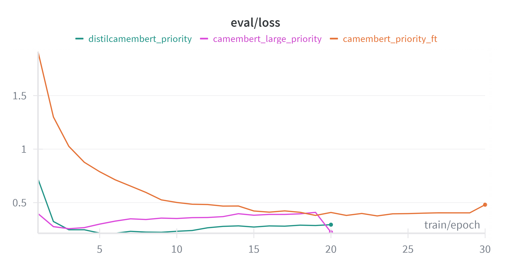
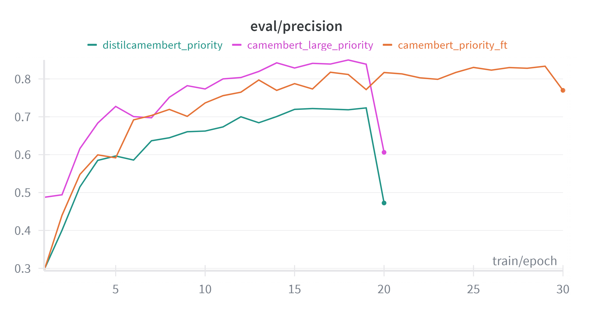
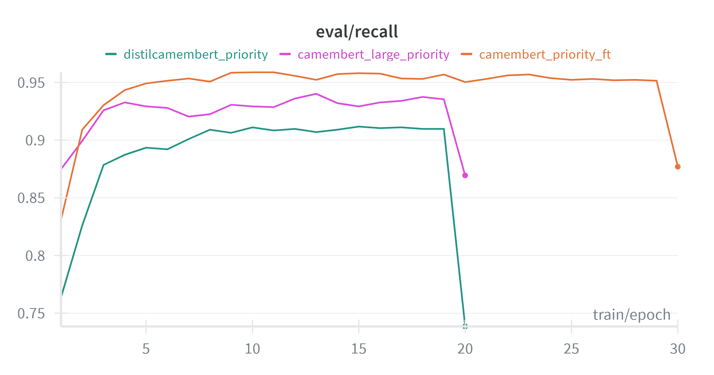
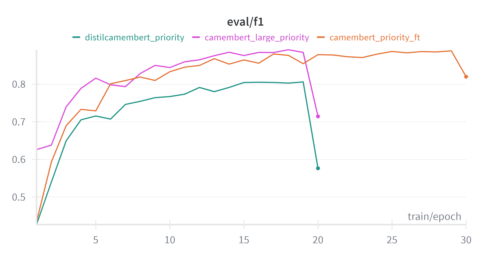

# French NER Benchmark on WiNER

This repository benchmarks **French Named Entity Recognition (NER)** models on **WiNER** (Wikinews for NER), using **entity-level exact match** evaluation. It compares **off‑the‑shelf** tools (spaCy, Flair, Stanza, HF models, GLiNER) and **custom fine‑tuned CamemBERT** variants.

---

## Goals

- Compare multiple NER paradigms on a single French dataset
- Report **micro** and **macro** precision/recall/F1
- Analyze **per‑entity‑type** performance
- Inspect nested entity behavior (WiNER supports nesting)

---

## Dataset (WiNER)

- **Language:** French
- **Domain:** Wikinews
- **Format:** BRAT (`.txt` + `.ann`)
- **Labels:** Person, Location, Organization, Date, Event, Product, Hour

Dataset location: `data/WiNER-fr/`

---

## Project Structure

```
ner_benchmark/
├── data/                 # WiNER BRAT data
├── data_hf/              # HF datasets for training
├── logs/                 # SLURM logs
├── models/               # Trained models
├── results/
│   ├── predictions/      # JSONL predictions
│   └── eval/             # CSV evaluation outputs
├── scripts/              # SLURM job scripts
├── splits/               # Train/dev/test splits
└── src/                  # Python pipeline
```

---

## Setup

Recommended packages:

- `torch`, `transformers`, `datasets`, `seqeval`
- `spacy`, `flair`, `stanza`, `gliner`
- `pandas`, `numpy`

> Models are downloaded automatically by each framework (HF, spaCy, Flair, Stanza, GLiNER).

---

## Quickstart (Inference + Evaluation)

1) **Run a model** (example HF CamemBERT):

```bash
python src/run_hf.py \
  --winer_root data/WiNER-fr \
  --model Jean-Baptiste/camembert-ner \
  --max_length 512 \
  --stride 128 \
  --ids_file splits/test_ids.txt
```

2) **Evaluate all predictions** in a folder:

```bash
python src/evaluate_winer.py \
  --winer_root data/WiNER-fr \
  --pred_dir results/predictions \
  --out_dir results/eval
```

Outputs:
- `results/eval/summary_models.csv`
- `results/eval/per_label_metrics.csv`
- `results/eval/best_model_per_label.csv`

---

## Scripts (SLURM)

The `scripts/` folder contains ready-to-run SLURM jobs for:

- spaCy (`run_spacy_sm.sh`, `run_spacy_md.sh`)
- HF baselines (`run_hf_camembert.sh`, `run_hf_distilcamembert.sh`, `run_bert-base-multilingual-cased-ner.sh`)
- Flair (`run_flair.sh`)
- GLiNER (`run_gliner.sh`)
- Stanza (`run_stanza.sh`)
- Rules (`run_rules_winer.sh`)
- Training (`train_camembert_large_winer.sh`, `train_distilcamembert_winer.sh`, `train_camembert.sh`)

---

## Training Pipeline (HF Fine‑Tuning)

1) **Create deterministic splits**

```bash
python src/make_splits_winer.py \
  --winer_root data/WiNER-fr \
  --out_dir splits \
  --train_years 2016,2017 \
  --test_years 2018 \
  --dev_ratio 0.10
```

2) **Build HF dataset (tokenized windows)**

```bash
python src/build_hf_dataset_winer.py \
  --splits_json splits/winer_splits.json \
  --model_name almanach/camembert-large \
  --out_dir data_hf/winer_camembert_large_priority \
  --max_length 512 \
  --stride 128
```

3) **Train**

```bash
python src/train_hf_winer_ner.py \
  --base_model almanach/camembert-large \
  --dataset_dir data_hf/winer_camembert_large_priority/dataset \
  --label2id data_hf/winer_camembert_large_priority/label2id.json \
  --id2label data_hf/winer_camembert_large_priority/id2label.json \
  --output_dir models/camembert_large_priority \
  --epochs 20 \
  --lr 2e-5 \
  --train_batch 2 \
  --eval_batch 2 \
  --grad_accum 8 \
  --fp16 \
  --best_metric eval_loss \
  --use_class_weights
```

4) **Predict with trained model (test set)**

```bash
python src/run_hf_trained.py \
  --dataset_dir data_hf/winer_camembert_large_priority/dataset \
  --winer_root data/WiNER-fr \
  --model_dir models/camembert_large_priority/best_model \
  --out_jsonl results/predictions/hf_camembert_large_priority_ft_TEST.jsonl
```

---

## Evaluation Protocol

**Entity-level exact match**: a prediction is correct only if **start**, **end**, and **label** all match.

We report:

- **Micro** precision/recall/F1 (global)
- **Macro** precision/recall/F1 (per label average)
- **Per‑label** results
- **Nested entity analysis** (WiNER supports nested entities)

---

## Results (from `results/eval`)

### Overall metrics by model

| Model | Micro P | Micro R | Micro F1 | Macro P | Macro R | Macro F1 |
|---|---:|---:|---:|---:|---:|---:|
| flair | 0.792 | 0.167 | 0.276 | 0.341 | 0.089 | 0.140 |
| gliner | 0.719 | 0.114 | 0.197 | 0.646 | 0.113 | 0.186 |
| bert-base-multilingual-cased-ner | 0.803 | 0.161 | 0.269 | 0.335 | 0.086 | 0.137 |
| camembert-ner | 0.104 | 0.025 | 0.040 | 0.035 | 0.012 | 0.018 |
| camembert_large_ft | 0.057 | 0.022 | 0.032 | 0.031 | 0.012 | 0.017 |
| camembert_ft | 0.271 | 0.152 | 0.195 | 0.261 | 0.174 | 0.205 |
| distilcamembert-base-ner | 0.103 | 0.023 | 0.038 | 0.035 | 0.011 | 0.017 |
| distilcamembert_ft | 0.033 | 0.013 | 0.019 | 0.019 | 0.008 | 0.010 |
| RULES | 0.620 | 0.039 | 0.074 | 0.183 | 0.107 | 0.128 |
| spacy_md | 0.770 | 0.164 | 0.271 | 0.324 | 0.086 | 0.133 |
| spacy_sm | 0.686 | 0.156 | 0.254 | 0.275 | 0.080 | 0.122 |
| stanza | 0.813 | 0.188 | 0.305 | 0.343 | 0.102 | 0.155 |

### Best model per label

| Label | Best Model | Precision | Recall | F1 | Gold Support |
|---|---|---:|---:|---:|---:|
| Date | gliner | 0.862 | 0.467 | 0.606 | 3817 |
| Event | gliner | 0.275 | 0.537 | 0.364 | 751 |
| Hour | RULES | 0.883 | 0.662 | 0.757 | 945 |
| Location | gliner | 0.881 | 0.544 | 0.673 | 8720 |
| Organization | gliner | 0.533 | 0.580 | 0.556 | 4218 |
| Person | glinerr | 0.802 | 0.623 | 0.701 | 5057 |
| Product | camembert_ft | 0.359 | 0.209 | 0.264 | 674 |

---

## Training Curves (placeholders)

> Replace the paths with your images.







---

## Notes

- WiNER contains **nested entities**; most tools output **flat** spans.
- Evaluation is **strict exact match** on spans + labels.
